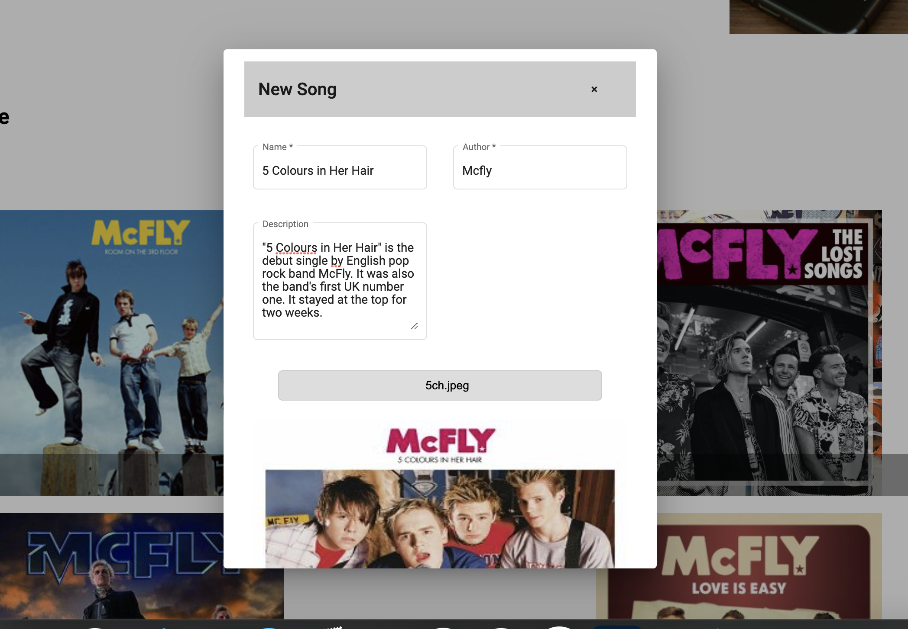
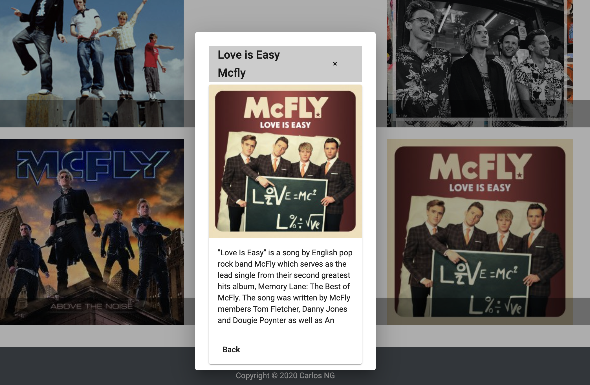

# SongApp

---

Simple aplicación web para desplegar y almacenar información de canciones (CRUD).  
* Frontend realizado con Angular en su última versión, utilizando herramientas como Angular 
Material y Flex Layout para su maquetación.
* Backend realizado con Django, utilizando la herramienta Django REST Framework para su implementación.

# New song
-- 

Formulario para agregar canciones. Nombre, autor, descripción e imagen de la canción. Puede previsualizarse la imagen a subir como se muestra a continuación:

# Song detail

---

Se despliega una ventana emergente detallando la información de la canción seleccionada.

